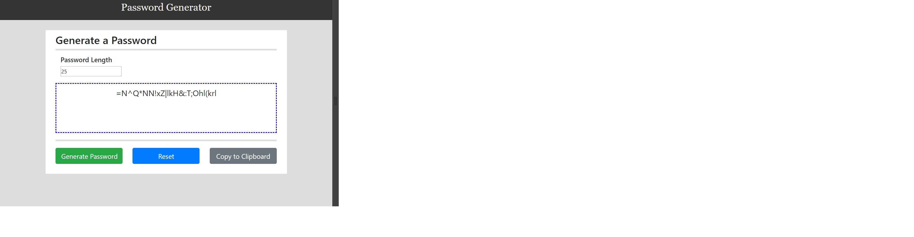
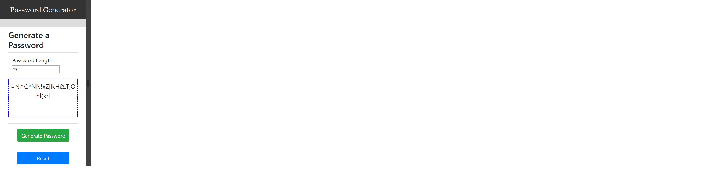

# passwordGenerator

Summary

The web application is a password generator that allows the user to select from an array
of character sets including:
- Lowercase characters
- Uppercase characters
- Numeric characters
- Special characters

The selected character sets will be added to a 'charSet' string which will then be used to
generate the password by randomly selecting characters from the 'charSet' string. The length
of the password is decided by the user and the application will continue to select random
characters until the password length is reached.

Additional functions include copy to clipboard and reset where the user is able to select
the generated password and paste it into another document. The reset method enables the user
to set the application to it's default values in order to generate a new password but it is
not necessary as the user can simply click on the generate password button again.

The application uses 'addEventListener' so that when one of the buttons is clicked on, it will
initiate the associated function. The use of 'preventDefault' and 'stopPropagation' methods are
used to prevent the window from going to it's default settings when the function is run and
prevents the clicked event from affecting the parent elements in the application.

The purpose of this application is to demonstrate the use of functions and 'addEventListener' so
that events are able to be delegated to different elements in an html file. In addition, implementing
responsive behaviour of html files using media queries. This enables the developer to create applications
that can be viewed on multiple devices and screen sizes such as:
- iphone
- Tablet
- Laptop
- Desktop

The following methods, objects and API's (Application programming Interface) were used in this web
application to demonstrate how javaScript can be used to apply calculations and functions to elements
in an html file:
- Arrays 
- Functions
- While Loops
- For Loops
- IF Statements
- addEventListener
- preventDefault method
- stopPropagation method

Getting Started

This documentation will assist you in viewing this project. To view the project either open
the url of the deployed application with the following address in any browser:

https://pozengineer.github.io/passwordGenerator/

Download and clone the repository from GitHub using the following command:

git clone https://github.com/pozengineer/passwordGenerator.git

The following files are used to create the application:
- index.html
- reset.css
- style01.css
- javaScript02.js
There are additional files that should be disregarded. They were used as the initial building
blocks for the application but want to keep them for future reference.

This application was built using:
- HTML: HyperText Markup Language that allows the developer to structure webpages
- CSS: Style Sheet Language that allows the developer to style an HTML document
- JavaScript: Programming Language that allows the developer to apply functions and methods to an HTML document 
- BootStrap: Library of HTML and CSS files and code https://getbootstrap.com/

